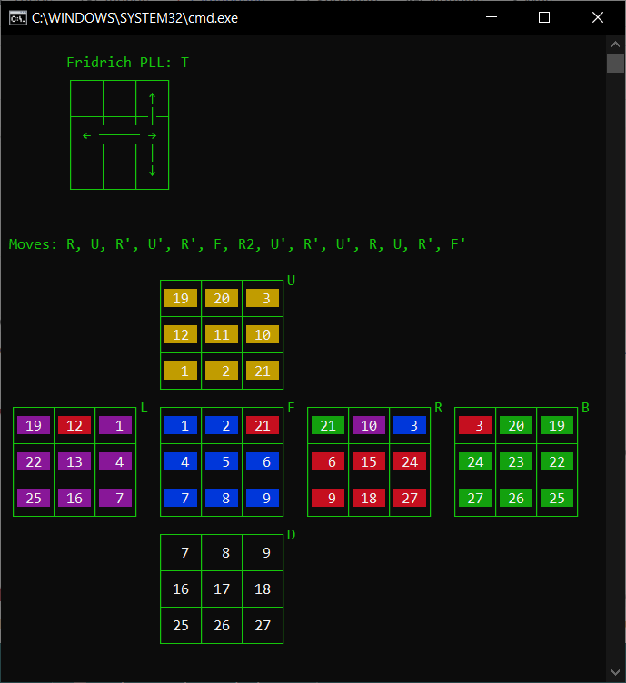

# RubikSolver
 Código experimental para resolver automaticamente cubos de rubik o jugar con los algoritmos de forma grafica en ascii. (En desarrollo)

### Capturas

Movimientos del cubo mediante código y presentación gráfica (v1.0.1)

```Python
cube = Cube()          # Genera el objeto del Cubo

# Obtiene la información del algoritmo tipo T en los pasos PLL (Permutate Last Layer) del Método Fridrich
T = Algo.Fridrich.PLL.T
print(T.info)          # Imprime de forma gráfica (Ascii Art) el intercambio de piezas
cube.move(T.algo)      # Hace los movimientos en el cubo virtual

cube.showLogs()        # Muestra los movimientos realizados
cube.prettyColors()    # Imprime en Ascii Art el resultado del cubo virtual con los movimientos realizados
```


